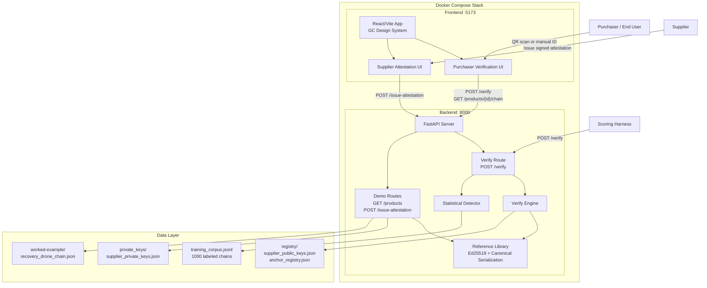
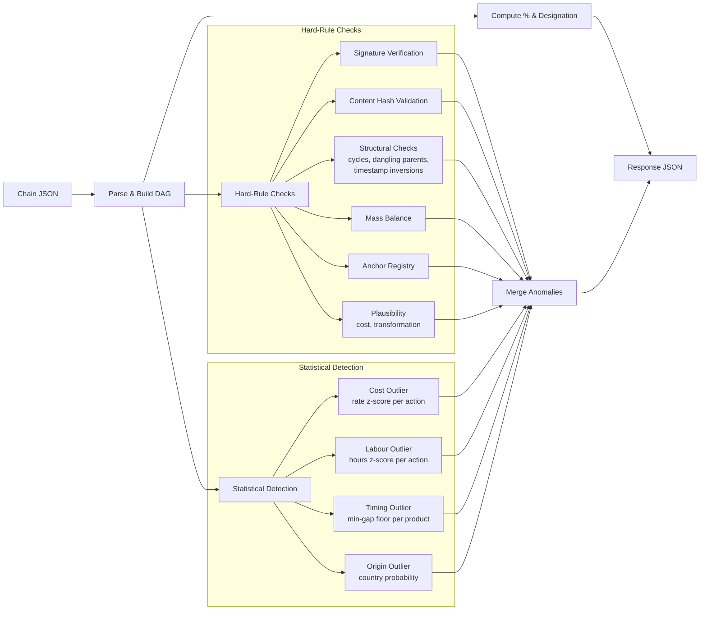
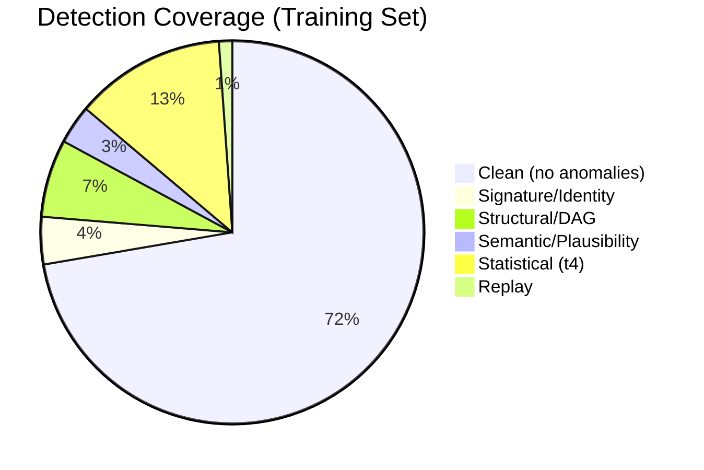
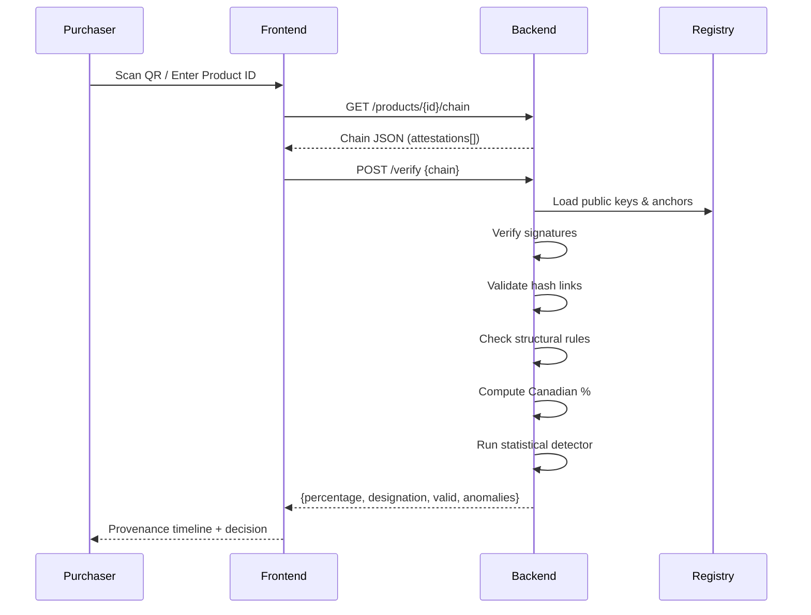
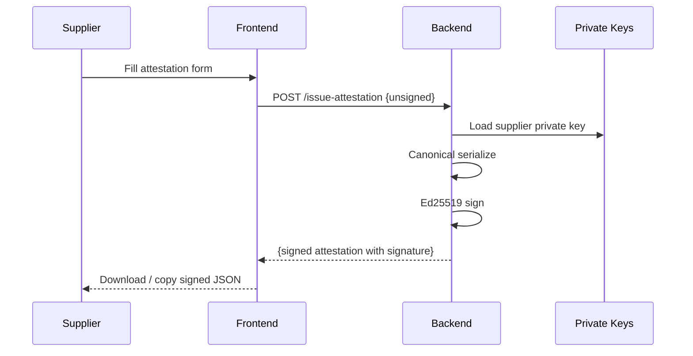

# Architecture

## System Overview

## Verification Pipeline

## Anomaly Detection Categories

## Data Flow: Purchaser Verification

## Data Flow: Supplier Attestation

## Technology Stack

| Layer | Technology |
|---|---|
| Frontend | React, Vite, TypeScript, GC Design System, html5-qrcode |
| Backend | Python, FastAPI, uvicorn |
| Crypto | Ed25519 (via `cryptography` library), SHA-256 |
| Packaging | Docker Compose |
| Scoring | Self-test harness against 1000 labeled chains |
